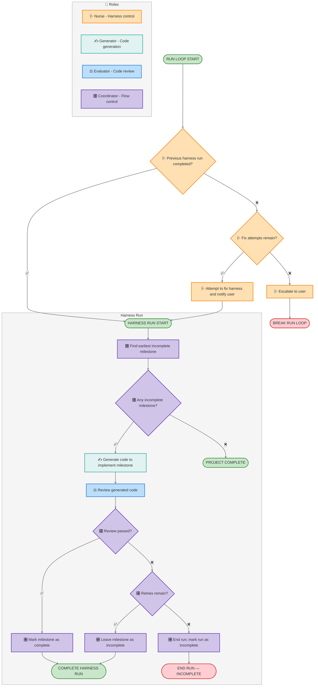

# Harness Control Flow

Lifecycle for the fulcra-app-starter harness. A single **harness run** processes one
milestone; the Nurse re-triggers runs (cron, manual, etc.) to advance the project.

Roles:

- 🩺 **Nurse** — harness control: health-check, fix attempts, escalation.
- ✍️ **Generator** — writes code for a milestone.
- ⚖️ **Evaluator** — reviews the generated code and returns a verdict.
- 🎛️ **Coordinator** — flow control and milestone state.



## Tracking System

The harness tracks progress using two mechanisms:

1. **Custom Annotation** — Append-only log of run events (step starts, completions, errors)
2. **Workspace Files** — Persistent state (progress.md, outstanding-issues.md)

The custom annotation enables the harness dashboard to show live run status. Workspace files enable resume capability and issue tracking.

## Setup

When setting up the harness (before first run), create a custom data type to
hold run events. Use `MomentAnnotation` as the base type — it stores a free-form
`note` (where we pack each run event as JSON) plus a timestamp:

```bash
uvx fulcra-api data-type create MomentAnnotation "Harness Runs: <project-name>"
```

Save the returned data type ID (of the form `MomentAnnotation/<UUID>`). This is
used as `PUBLIC_HARNESS_ANNOTATION_ID` in the dashboard's environment variables.

## Recording Run Events

Write records at key points in the flow with `fulcra-api record`. Pack the event
fields (`run_id`, `step`, `status`, `detail`) into the `note` as a JSON string;
the record's timestamp is set automatically:

```bash
uvx fulcra-api record MomentAnnotation/<UUID> \
  --note='{"run_id": "<run-id>", "step": "GENERATE", "status": "started", "detail": ""}'
```

The dashboard reads each record's `recorded_at` for timing and parses `note` for
the event fields, so nothing else needs to be set. The JSON shapes below show
the `note` payload for each kind of event.

### Run Start
```json
{
  "note": "{\"run_id\": \"<unique-run-id>\", \"step\": \"RUN_START\", \"status\": \"started\", \"detail\": \"Starting harness run\"}",
  "recorded_at": "<ISO-8601>"
}
```

### Step Transitions
Write records when each step starts and completes:

**Step Start:**
```json
{
  "note": "{\"run_id\": \"<run-id>\", \"step\": \"<STEP_NAME>\", \"status\": \"started\", \"detail\": \"\"}",
  "recorded_at": "<ISO-8601>"
}
```

**Step Complete:**
```json
{
  "note": "{\"run_id\": \"<run-id>\", \"step\": \"<STEP_NAME>\", \"status\": \"completed\", \"detail\": \"<result-summary>\"}",
  "recorded_at": "<ISO-8601>"
}
```

**Step Failed:**
```json
{
  "note": "{\"run_id\": \"<run-id>\", \"step\": \"<STEP_NAME>\", \"status\": \"failed\", \"detail\": \"<error-message>\"}",
  "recorded_at": "<ISO-8601>"
}
```

### Progress Updates (long-running steps)

`FIX_ATTEMPT`, `GENERATE`, and `REVIEW` can each run for a long time. To keep the
dashboard live while they run, emit an extra progress record for the currently
running step every few minutes — reuse `status: "started"` and update `detail`
with what is happening now:

```json
{
  "note": "{\"run_id\": \"<run-id>\", \"step\": \"<STEP_NAME>\", \"status\": \"started\", \"detail\": \"<progress-summary>\"}",
  "recorded_at": "<ISO-8601>"
}
```

Keep these coarse — every few minutes, not every action — so a run accumulates a
handful of progress records, not hundreds. The dashboard keeps the newest record
per step, so the step box shows the latest `detail` and switches to
`status: "completed"` (or `"failed"`) when you write that step's final record.

### Key Steps to Track

- `FIND_MILESTONE` — Coordinator finding next incomplete milestone
- `GENERATE` — Generator writing code
- `REVIEW` — Evaluator reviewing code  
- `MARK_COMPLETE` — Coordinator marking milestone complete
- `ESCALATE` — Nurse escalating to user
- `FIX_ATTEMPT` — Nurse attempting fix
- `RUN_COMPLETE` — Run finished successfully
- `RUN_INCOMPLETE` — Run ended without completion

### Run IDs and terminal steps

The dashboard groups records by `run_id` and infers which branch of the flow a
run took from the steps present, so record them consistently:

- **Mint a new `run_id`** at the top of each run-loop iteration, before the
  Nurse health-check. Record the Nurse's `FIX_ATTEMPT` or `ESCALATE` under that
  new `run_id` — the dashboard treats them as the start of the run they precede.
  An escalation writes only an `ESCALATE` record for that new `run_id` (no
  harness run follows); the dashboard shows it as an "escalated" run.
- When a review fails but **retries remain**, the run leaves the milestone
  incomplete yet still ends with **`RUN_COMPLETE`** (flow: *Leave milestone
  incomplete → COMPLETE HARNESS RUN*). Use **`RUN_INCOMPLETE`** only when retries
  are **exhausted** (*End run → END RUN — INCOMPLETE*). The dashboard uses this
  distinction to show "Retry Next Run" versus "End Run — Incomplete".
- When no incomplete milestone remains, still write a `FIND_MILESTONE` record
  (with no `GENERATE` after it) so the dashboard renders "Project Complete".

## Workspace Updates

### outstanding-issues.md

Update `workspace/<project-name>/outstanding-issues.md` when issues occur:

**On Escalation:**
Add issue with timestamp, run ID, and description. Include what the user needs to do.

**On Resolution:**
Remove or mark resolved when user addresses the issue or a subsequent run succeeds.

**Format:**
```markdown
# Outstanding Issues

## [ISO-8601 timestamp] - Run <run-id>

**Issue:** <description>
**Action Needed:** <what user should do>

---

## [timestamp] - Run <older-run-id> [RESOLVED]

**Issue:** <description>
**Resolution:** <how it was resolved>
```

### progress.md

Update `workspace/<project-name>/progress.md` after each harness run (see workspace.md for full structure). Include:
- Harness State section with current run status, retry count, last run timestamp
- Active Milestone
- Recent Completions (when milestones complete)
